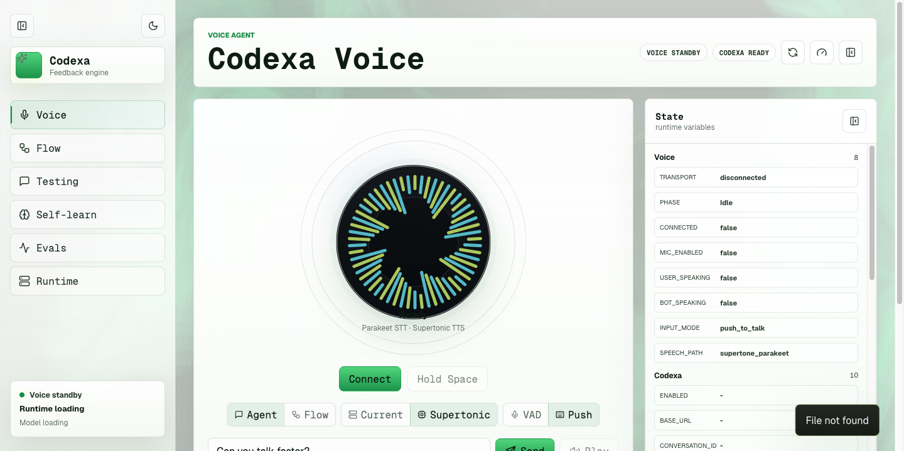

# Codexa

Draft hackathon submission README.

## GitHub link

https://github.com/Karanvir1729/codexa/tree/Cleanreadme

## 1. What is this?

Codexa is a browser voice coding agent. You speak a coding task, the app
transcribes it, routes it through a Nemotron-backed agent, sends coding work into
Codexa/Codex, speaks back status, and records the whole turn so failures can
become evals and prompt improvements.

The project is built around one loop:

```text
voice input -> Pipecat WebRTC -> NVIDIA STT -> Nemotron LLM
  -> Codexa planning / Codex execution -> Gradium TTS
  -> transcript + latency + feedback + eval result -> improved prompt/runtime
```

The visible demo surface is the local React console. It has a Voice page, a
Builder page for Codexa/Codex tasks, a Flow Studio, self-learning state, and eval
controls.



## 2. Demo video

TODO: add the final video link here. Target: 45 to 55 seconds.

Planned video outline:

1. Open the browser Voice console and show the `nvidia_gradium` path ready.
2. Connect with Pipecat SmallWebRTC.
3. Say a coding request such as: "Create a tiny static habit board app and plan
   it in Codexa."
4. Show Codexa/Builder state updating with the task/session.
5. Show the Cekura result summary with the final 10/10 regression pass.

## 3. Cekura, Nemotron, and Pipecat

### Cekura

We used Cekura as the external regression harness for the browser voice coding
agent.

- Project ID: `5817`
- Agent ID: `18023`
- Provider: self-hosted Custom WebSocket chat
- Test WebSocket: `/api/cekura/ws`
- Local status endpoint: `/api/cekura/status`
- Local evaluator catalog: `config/cekura/evaluators.json`
- Sync/run script: `scripts/cekura_testing.py`

The active Cekura project currently has 10 synced conditional evaluators
covering identity/no handoff, voice speed control, tone control, long-form answer
behavior, latency explanation, ambiguous "OnePlus One" handling, simple math,
Codexa routing, interruption/cancel behavior, and graceful model failure
language. The repo catalog is the local source for syncing and extending those
checks.

Cekura text-mode runs connect to `/api/cekura/ws`. Each message is routed
through `run_voice_text_turn`, which records the turn as assumed-STT voice input
and stores transcript, latency trace, runtime action state, flow state, Codexa
metadata, and prompt-version metadata in SQLite. Cekura result webhooks can be
stored in `eval_runs` and `eval_results`, which makes external failures visible
inside the app's self-learning panel.

Measured Cekura improvement:

- First synced external regression run on May 30, 2026 at 18:02 UTC: `40%`
  success rate (`4/10` scenarios).
- Worst interim regression during debugging: `20%`.
- Final serial external regression run on May 30, 2026 at 20:05 UTC:
  `100%` success rate (`10/10` scenarios, result `591275`).

That moved the external Cekura suite from `4/10` to `10/10`, a 60 percentage
point improvement.

### Nemotron / NVIDIA

The default high-reasoning path uses a Nemotron-compatible OpenAI-style endpoint:

```text
LLM_PROVIDER=nemotron
NEMOTRON_LLM_MODEL=nvidia/nemotron-3-super
```

The repo also includes NVIDIA NIM and self-hosted vLLM options for open-weight
experiments, including `nvidia/llama-3.3-nemotron-super-49b-v1.5` and
`nvidia/Llama-3.1-Nemotron-Nano-8B-v1`. The point was to keep the voice runtime
model-routable: fast enough for live speech turns, but still able to switch to a
larger reasoning model for coding tasks.

### Pipecat

Pipecat is the real-time voice transport and pipeline layer. The browser demo
uses Pipecat SmallWebRTC from the React console into FastAPI. The backend then
connects the voice frames to:

- NVIDIA WebSocket STT for streaming transcription.
- Nemotron for intent, coding, and runtime decisions.
- Codexa/Codex for planning and implementation work.
- Gradium semantic VAD/TTS for turn-taking and spoken output.

The same backend still has Twilio/Pipecat hooks for phone-call experiments, but
the hackathon demo path is browser-first because it is easier to test and record.

## 4. What was new during the hackathon?

Starting point: the team already had pieces of a Codexa/Codex app-builder idea
and voice-agent scaffolding.

Built or substantially changed during the hackathon:

- A browser-first voice coding flow using Pipecat SmallWebRTC.
- The `nvidia_gradium` speech path: NVIDIA WebSocket STT, Nemotron LLM, Gradium
  semantic VAD/TTS, and Codexa orchestration.
- The Codexa bridge that maps one voice conversation to one Codexa session and
  preserves follow-up turns such as status checks or approvals.
- The integrated Builder page inside the main voice UI, replacing a separate
  app-builder frontend for normal testing.
- Deterministic text-first voice testing through `/api/voice/text-test/turn`, so
  agent behavior can be tested without microphone or browser audio flakiness.
- Cekura integration: self-hosted WebSocket endpoint, seed/reset/result hooks,
  evaluator JSON catalog, and the sync/run/triage script.
- The self-learning loop: SQLite transcripts, latency traces, prompt versions,
  local YAML evals, scheduled evals, and exportable training examples.
- Readiness/preflight checks that fail loudly when STT, TTS, Codexa, or LLM
  dependencies are missing instead of silently falling back to a mock path.

## 5. Feedback on the tools

### NVIDIA / Nemotron feedback

What worked well:

- Nemotron was strong enough for routing and coding-agent responses once the
  prompt made the voice-specific constraints explicit.
- OpenAI-compatible serving made it easy to swap between hosted NVIDIA/Nemotron
  endpoints and self-hosted vLLM experiments.
- The smaller Nemotron profile is useful for latency-sensitive voice tests, while
  the larger model path is better suited to coding and planning turns.

What could be better:

- Voice agents need predictable first-token latency more than peak benchmark
  quality. More published latency guidance for each model/profile would help.
- Model names and deployment paths are easy to mix up across NIM, hosted APIs,
  local vLLM, and OpenAI-compatible shims.
- The model can over-answer simple voice commands unless prompts and evals force
  concise behavior.

### Cekura feedback

What worked well:

- The WebSocket text mode was the fastest way to regression-test voice-agent
  behavior without needing live audio for every run.
- Conditional evaluators were a good fit for voice flows because each test could
  simulate follow-up turns, interruptions, and task status questions.
- The result history made iteration visible: we could see the agent move from
  partial pass rates to a final 10/10 run.

Friction and possible bugs:

- The result aggregate fields can be confusing. Some intermediate results showed
  `success_rate`, `met_expected_outcome_count`, `total_expected_outcome_count`,
  and run counts that were not immediately intuitive together.
- Public tunnel setup is a fragile part of the workflow. A stale local tunnel or
  missing WebSocket secret can look like an agent failure even when the app is
  fine.
- Failure triage would be easier with a one-click view of failed scenario,
  transcript, matched condition, and metric reason in one payload.

### Pipecat feedback

What worked well:

- SmallWebRTC gave us a practical browser-native voice path without needing a
  phone number for every test.
- Pipecat's pipeline model made it possible to swap STT, VAD, LLM, and TTS
  pieces independently.
- VAD and interruption behavior fit naturally into the runtime-action/eval loop.

What could be better:

- Custom STT/VAD/TTS integrations require careful audio-format and sample-rate
  matching. More end-to-end examples for custom services would reduce setup
  time.
- Browser dependency/version mismatches can be hard to diagnose from the first
  error message.
- It would help to have more official examples of capturing transcripts,
  latency, and custom runtime metadata from the pipeline for evaluation loops.

## 6. Live link

TODO: add a public live link if we deploy the demo for judging.

Current status: the project runs locally and through temporary public tunnels for
Cekura WebSocket testing. The local demo surfaces are:

```text
Voice UI / Builder UI: http://127.0.0.1:5173
Backend API:           http://127.0.0.1:8000
Codexa supervisor API: http://127.0.0.1:4317
```

## Quick local run

```bash
python -m venv .venv
source .venv/bin/activate
pip install -e "backend[dev,voice]"
npm --prefix frontend ci

./scripts/run_backend.sh
npm --prefix frontend run dev -- --host 127.0.0.1
```

For Cekura:

```bash
export CEKURA_WEBSOCKET_URL=wss://<public-backend-host>/api/cekura/ws
./scripts/run_cekura.sh sync
./scripts/run_cekura.sh run --wait --frequency 1
./scripts/run_cekura.sh triage
```
