# Codexa Voice

Codexa Voice is a voice-first Codex workbench: think Cursor after it learns how to keep building while you are away from the keyboard. Today, vibe coding still makes people sit at a desk and watch an agent run. That waiting is the product gap. Codexa Voice turns it into a walk-away workflow: describe the build, approve the Megaplan, let Codex spawn parallel responsibility lanes, and take a walk while the system keeps coding, validating, and reporting progress.

Live app: [https://34.121.55.47.sslip.io/](https://34.121.55.47.sslip.io/)

## 1. What Is This?

Codexa Voice is a command center for agentic software work over voice, phone, text, and browser UI. The user-facing idea is simple: talk to Codex like a senior teammate, let it create a real implementation plan, approve the work, then leave the desk while the agent keeps coding with visible state, validation, and review.

The system is built around one contract: every voice turn is operational data. Browser voice, Twilio calls, Cekura tests, self-learning, and Codex execution all flow through the same backend state model. A coding request can become a Megaplan, an approval gate, a local Codex CLI session, parallel advisory lanes, a live flowchart, validation evidence, and a final quality pass.

```mermaid
flowchart LR
  User["User: browser mic, Twilio, or text"] --> Voice["Pipecat SmallWebRTC / Twilio voice"]
  Voice --> API["FastAPI voice backend"]
  API --> STT["NVIDIA streaming STT"]
  API --> State["SQLite operational store"]
  STT --> Brain["Nemotron reasoning layer"]
  Brain --> Router["Codexa voice orchestrator"]
  Router --> Megaplan["Megaplan skill: .head-developer/MEGAPLAN.md"]
  Megaplan --> Approval["Human approval gate"]
  Approval --> Codex["Local Codex CLI implementation session"]
  Codex --> Advisor["Parallel subagent advisor watcher"]
  Codex --> Flow["Parallel flowchart watcher"]
  Codex --> Quality["Final Codex quality check"]
  Advisor --> UI["Builder / Voice / Flow UI"]
  Flow --> UI
  Quality --> UI
  State --> Learner["FeedbackLearner prompt versions"]
  Cekura["Cekura external regression suite"] --> API
  Learner --> Brain
```

The key architecture choice is that Codex still owns the repo through one local implementation session. Around that session, the product runs specialized parallel processes: a short read-only subagent advisor before approval, parallel Codex subagent lanes during execution, a continuous flowchart maker that writes `.head-developer/flowchart.json`, MCP action logging, and a final Codex reviewer that writes quality evidence. The UI is not just a chat transcript; it is a live operations surface for agent work.

The Builder flow makes the orchestration explicit: the main Codex path, the parallel Codex agent lane, and the quality path are separate surfaces in the product, not hidden terminal conventions.

The Megaplan panel is the handoff point between spoken intent and real implementation. Codex writes the plan first, the user approves it, and only then does the implementation session start changing the selected repo.

## 2. Video

Demo video: [https://www.youtube.com/watch?v=5LBfo_Mt4WA](https://www.youtube.com/watch?v=5LBfo_Mt4WA)

## 3. How We Used Cekura, Nemotron, And Pipecat

**Cekura**

Cekura is the external regression system for the voice agent. The registered agent is `Voice Agent Feedback Engine`, project `5817`, agent `18023`, connected as a self-hosted Custom WebSocket chat agent at `/api/cekura/ws`.

The evaluator catalog lives in [`config/cekura/evaluators.json`](./config/cekura/evaluators.json) and covers 12 agent behaviors: identity, voice speed, tone control, long-form answers, latency explanation, ambiguous speech interpretation, concise math, Codexa task routing, named project planning, planning status follow-up, interruption cancelation, and clear operational error language.

What we were testing was whether the voice agent behaves like a real coding supervisor instead of a generic assistant. The important questions were: does it route coding work into Codexa, preserve session state, expose approval status, keep voice behavior controllable, handle ambiguous speech correctly, and produce evaluable outcomes?

The concrete improvement was moving from manual spot checks to a replayable evaluation loop:

- `0 -> 12` external regression scenarios.
- Cekura runs are ingested through `/api/cekura/hooks/result`.
- Results are stored as `eval_runs` and `eval_results`.
- Failures feed the same `FeedbackLearner` path as operator feedback.
- New prompt versions can be generated from actual test evidence instead of subjective notes.

**Nemotron**

Nemotron is the reasoning layer behind the live voice agent. The backend uses an OpenAI-compatible adapter with `LLM_PROVIDER=nemotron`, `NEMOTRON_LLM_MODEL=nvidia/nemotron-3-super`, and production profiles that can target models such as `nvidia/llama-3.3-nemotron-super-49b-v1.5`.

In this architecture, Nemotron is responsible for intent, planning language, concise status explanation, and deciding when a voice turn should become Codex work. It is intentionally separated from execution: Nemotron reasons and routes; Codex changes files through the supervised local CLI path.

**Pipecat**

Pipecat is the realtime media runtime. The browser creates a `PipecatClient` with `SmallWebRTCTransport`, posts an offer to `/api/offer`, and the backend runs the voice pipeline through NVIDIA streaming STT, Nemotron reasoning, Codexa orchestration, and Gradium TTS.

Pipecat gave the project a real low-latency voice loop with inspectable stages. The same application state records voice phase, input mode, runtime actions, model profile, latency traces, and Codex session IDs, which is what makes the UI useful while Codex is working.

## 4. What Was New During The Hackathon?

During the hackathon, we built the product layer that turns a voice assistant into a walk-away Codex workbench:

- The voice runtime: Pipecat SmallWebRTC, `/api/offer`, NVIDIA streaming STT, Nemotron routing, Gradium TTS, and Twilio voice entry points.
- The Codexa bridge: voice turns can create or continue Codex projects, ask for Megaplans, answer status questions, and preserve task context across follow-ups.
- The Megaplan workflow: `.head-developer/MEGAPLAN.md` includes approval gate, repository context, requirement summary, technical requirements, proposed product direction, subagent check-in, validation plan, and completion bar.
- Parallel Codex orchestration: one implementation session owns the repo while advisory, flowchart, and quality-check Codex processes run beside it and report structured state.
- The Builder UI: skill inventory, runtime settings, approval state, live flowchart, Megaplan visibility, quality path, and Codex run telemetry.
- The MCP server: structured tools for project creation, task launch, worker/session inspection, command execution, approval requests, log tailing, and Codex history inspection.
- The Cekura loop: evaluator catalog, sync/run script, WebSocket agent endpoint, seed/reset/result hooks, secret checks, and local eval ingestion.
- The self-learning loop: persisted turns, latency traces, runtime actions, eval results, feedback records, and prompt versions.

This is the part that feels like the next Cursor: the product is not only an editor surface. It is an agent operations environment where the user can speak a goal, approve the plan, leave the desk, and come back to a traceable implementation run. Instead of one person waiting on one agent, Codexa Voice uses parallel Codex lanes for voice runtime, evaluation, Builder UI, and quality review so the wall-clock wait shrinks while accountability improves.

## 5. Tool Feedback

**NVIDIA / Nemotron**

Nemotron worked well as the structured reasoning layer. The OpenAI-compatible interface made it practical to keep the voice runtime stable while changing the serving target, and the model was strong at concise status explanations, routing decisions, and planning language.

The biggest opportunity is documentation around realtime voice use. Teams need model guidance framed around first-token latency, warm concurrency, streaming behavior, and the tradeoff between quick conversational turns and deep planning turns. Nemotron is a strong fit for this architecture, and clearer voice-agent deployment recipes would make it faster to ship.

**Cekura**

Cekura mapped well to agent behavior because the scenarios can test product truth, not just HTTP status. The WebSocket agent model was the right fit for a self-hosted voice/coding agent, and result webhooks made it possible to close the loop into our own prompt-learning system.

The best product improvement would be deeper run observability: scenario ID, run ID, headers, close reason, seed/reset output, final agent message, and evaluator reasoning should be visible together. For stateful agents, seed/reset ergonomics matter a lot because state is part of correctness.

**Pipecat**

Pipecat gave us the media pipeline we needed without turning the hackathon into WebRTC plumbing. The pipeline abstraction made STT, LLM, TTS, and transport boundaries clear enough to instrument.

The main improvement request is stronger built-in diagnostics for voice apps: mic permission, ICE negotiation, STT connection, model streaming, TTS synthesis, and playback each need distinct debug surfaces. Barge-in and interruption examples would also help teams build more natural voice agents faster.

## 6. Live Link

Live app: [https://34.121.55.47.sslip.io/](https://34.121.55.47.sslip.io/)

Useful implementation entry points:

- [`backend/app/config.py`](./backend/app/config.py): mainstream voice profile and provider configuration.
- [`backend/app/main.py`](./backend/app/main.py): voice, Twilio, Cekura, eval, and self-learn endpoints.
- [`backend/app/local_voice_runtime.py`](./backend/app/local_voice_runtime.py): Pipecat browser voice runtime.
- [`backend/app/codex_orchestrator.py`](./backend/app/codex_orchestrator.py): bridge from voice turns into Codexa/Codex.
- [`codex-phone-supervisor/backend/src/megaplan.ts`](./codex-phone-supervisor/backend/src/megaplan.ts): Megaplan generation and approval gate.
- [`codex-phone-supervisor/backend/src/codex-session-local.ts`](./codex-phone-supervisor/backend/src/codex-session-local.ts): local Codex session, flowchart watcher, subagent watcher, and quality check.
- [`apps/mcp-server/src/server.ts`](./apps/mcp-server/src/server.ts): structured MCP tools for orchestrated agent work.
- [`backend/app/cekura.py`](./backend/app/cekura.py): Cekura conversation IDs, cleanup hooks, and eval conversion.
- [`backend/app/feedback.py`](./backend/app/feedback.py): feedback learner and prompt-version generation.
- [`frontend/src/AppBuilder.tsx`](./frontend/src/AppBuilder.tsx): Builder UI for Megaplan, flow, approvals, skills, and runtime state.
