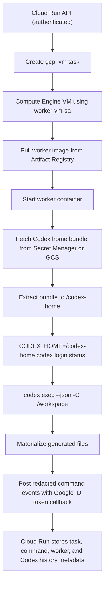

# GCP VM Codex Auth

## Selected Path

The selected path is `HEAD_DEVELOPER_CODEX_AUTH_METHOD=codex_home_bundle`.

The operator creates a dedicated `.codex-vm-home/` and logs into Codex CLI with ChatGPT/Codex credentials:

```bash
CODEX_HOME=.codex-vm-home codex login
scripts/gcp/create-codex-vm-home-bundle.sh
```

The setup script verifies `CODEX_HOME=.codex-vm-home codex login status`, runs a local `codex exec` nonce smoke, packages the dedicated home without sessions/logs, uploads the sensitive bundle to Secret Manager or restricted GCS, grants only `worker-vm-sa` read access, and deletes the temporary unencrypted bundle file.

At VM runtime, the worker fetches the bundle, extracts it into `/codex-home`, runs `CODEX_HOME=/codex-home codex login status`, then runs `codex exec`. Worker and command records include `codex_auth_method`, `codex_auth_secret_resource`, `codex_auth_validation_status`, and `codex_auth_validated_at`; auth file contents, tokens, cookies, and API keys are not printed.

`secret_manager_api_key` remains fallback-only and is not the live smoke path unless explicitly approved.

## OpenClaw

OpenClaw is not needed for auth. It can orchestrate Codex CLI through an additional gateway/skills runtime, but it does not remove the need for Codex CLI credentials and would add another assistant runtime. It is not the primary solution.

## Flowchart



## Smoke

Use `scripts/gcp/run-codex-home-bundle-smoke.sh` for the nonce landing-page smoke. It reports the VM name, worker image URI, Cloud Run URL, service account, auth method, bundle source type, Codex command event ID, generated files, nonce evidence, validation status, Codex history evidence when available, flowchart evidence, cleanup result, and remaining matching VM count.
